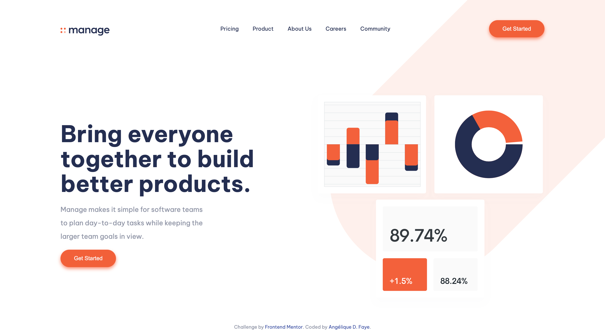
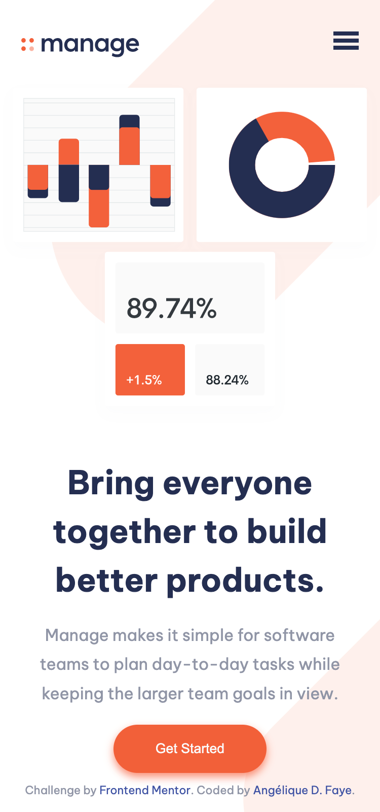

# Manage landing page

  
  
  

## Overview

_A static landing page for a team management Saas product!_

 

## Links

<a href="https://github.com/AngeliqueDF/manage-landing-page">GitHub repo</a> • <a href="[https://github.com/AngeliqueDF](https://stunning-sopapillas-58e3b3.netlify.app/)">Live demo </a>

 

## How to run the project

1. `git clone https://github.com/AngeliqueDF/manage-landing-page MY_FOLDER_NAME`
2. `cd MY_FOLDER_NAME`
3. `npm install`
4. `npm start`
5. visit `http://localhost:3000`

 

  

## Features

- Testimonials slider.
- Responsive.
- Accessible.
- Mobile menu.

## Technologies

- HTML.
- CSS.
- JavaScript.

## Status

### Planned changes

- [ ] Improve accessibility.
- [ ] Improve the slider user experience on desktop (any suggestion is welcome).
- [ ] Improve the mobile menu user experience.

## Author

- [@AngeliqueDF on GitHub.](https://github.com/AngeliqueDF)
- [Visit my website.](https://adf.dev)
- [View my Frontend Mentor profile.](https://www.frontendmentor.io/profile/AngeliqueDF)
